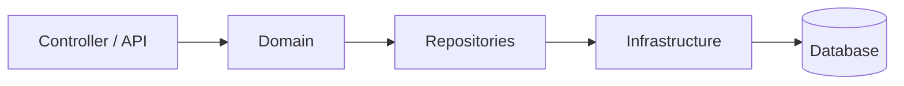

# 🛒 AlgoShop Ordering

> Serviço responsável pelo gerenciamento do domínio de pedidos da plataforma **AlgoShop**, desenvolvido seguindo princípios de **Domain-Driven Design (DDD)** e arquitetura em camadas.


---

# 📖 Sobre

O **Ordering Service** representa o domínio responsável pela criação e gerenciamento de pedidos do ecossistema AlgoShop.

O projeto foi desenvolvido priorizando modelagem de domínio rica, encapsulamento de regras de negócio e baixo acoplamento entre as camadas da aplicação.

Em vez de concentrar regras em Services, a maior parte da lógica encontra-se nas próprias entidades do domínio, seguindo o conceito de **Rich Domain Model**.

---

# 🏗 Arquitetura

O projeto está organizado em duas grandes camadas:

```text
src/main/java

domain
│
├── entity
├── valueobject
├── exception
├── repository
└── specification

infrastructure
│
├── persistence
│   ├── entity
│   ├── repository
│   ├── assembler
│   ├── disassembler
│   └── provider
```

---

## Fluxo da arquitetura



Toda a regra de negócio permanece dentro do **Domain**.

A infraestrutura apenas realiza persistência.

---

# 🎯 Conceitos aplicados

- Domain Driven Design (DDD)
- Rich Domain Model
- Aggregate Root
- Value Objects
- Repository Pattern
- Optimistic Lock
- Assemblers
- Disassemblers
- Encapsulamento das regras de negócio
- Persistence Ignorance

---

# 📂 Estrutura

```
domain
│
├── entity
│   ├── Order
│   ├── Customer
│   ├── ShoppingCart
│   ├── Product
│   └── OrderItem
│
├── valueobject
│   ├── Money
│   ├── Quantity
│   ├── Address
│   ├── Shipping
│   └── Billing
│
├── repository
│
└── exception
```

---

# 🧠 Modelo de domínio

O principal Aggregate Root da aplicação é:

```text
Order
```

Ele encapsula toda a consistência do pedido.

Exemplo de operações:

- adicionar item
- recalcular total
- alterar status
- validar transições
- controlar pagamento
- controlar cancelamento

Nenhuma dessas regras fica espalhada em Services.

---

# 💰 Value Objects

O projeto utiliza diversos Value Objects para evitar Primitive Obsession.

Exemplos:

- Money
- Quantity
- Address
- Billing
- Shipping
- Recipient

Isso reduz inconsistências e centraliza validações.

---

# 🧩 Aggregate Root

O Aggregate Root é representado pela entidade:

```
Order
```

Ela controla:

- itens
- pagamento
- entrega
- totais
- status
- cliente

Toda alteração passa obrigatoriamente por ela.

---

# 🔐 Identificadores tipados

Em vez de utilizar UUID ou Long diretamente, o projeto utiliza IDs específicos:

- OrderId
- CustomerId
- OrderItemId

Isso aumenta a segurança de tipos durante o desenvolvimento.

---

# 📦 Persistência

A infraestrutura é totalmente separada do domínio.

Existem entidades específicas para persistência:

```
OrderPersistenceEntity
CustomerPersistenceEntity
OrderItemPersistenceEntity
```

Essas entidades nunca "vazam" para o domínio.

A conversão acontece através de:

- Assemblers
- Disassemblers

---

# 🛠 Tecnologias

- Java 21
- Spring Boot 3.5
- Spring Data JPA
- Gradle
- Lombok
- H2 Database
- AssertJ
- JUnit 5

---

# ▶ Executando

Clone o projeto

```bash
git clone https://github.com/pedropaulo4/algashop-ordering.git
```

Entre na pasta

```bash
cd algashop-ordering
```

Execute

```bash
./gradlew bootRun
```

ou

```bash
gradlew.bat bootRun
```

---

# 🧪 Testes

Executar testes unitários

```bash
./gradlew test
```

Executar testes de integração

```bash
./gradlew integrationTest
```

Executar todos

```bash
./gradlew check
```

---

# 🎓 Objetivos do projeto

Este projeto foi desenvolvido para explorar práticas modernas de modelagem de domínio utilizando Java e Spring Boot.

Os principais objetivos incluem:

- modelagem rica
- separação entre domínio e infraestrutura
- persistência desacoplada
- código orientado ao domínio
- facilidade para evolução do negócio

---

# 📚 Aprendizados

Durante o desenvolvimento foram explorados conceitos como:

- Aggregate Root
- Value Objects
- Encapsulamento
- Repository Pattern
- Optimistic Lock
- Modelagem rica
- Clean Code
- DDD Tático
- Persistence Ignorance

---

# 🚀 Próximos passos

- Publicação de Domain Events
- Outbox Pattern
- PostgreSQL
- Testcontainers
- Docker Compose
- Kafka
- Observabilidade
- OpenAPI
- CI/CD

---

# 👨‍💻 Autor

Pedro Paulo Bertolini

Backend Software Engineer • Java • Spring Boot • AWS

---

## ⭐ Se este projeto foi útil para você, deixe uma estrela no repositório.